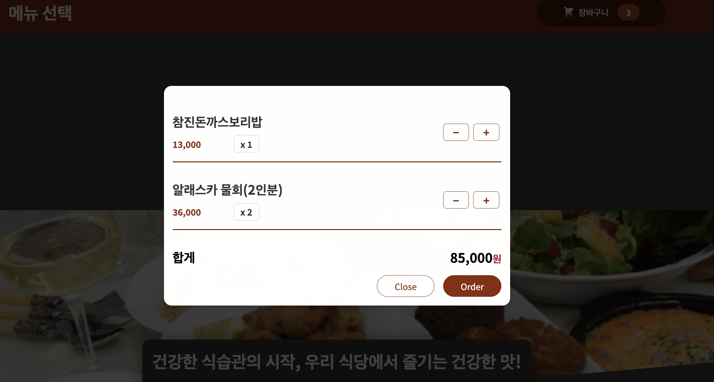

# 프로젝트명: 음식 배달앱 (meal-order-app)
> 웹사이트의 목적은 음식 주문 앱을 모방하는 것입니다. 메뉴 항목을 저장하고 새로 생성된 주문을 저장하기 위한 DB로 firebase를 사용하고 프런트엔드로 React.js를 사용했습니다.

앱에서 메뉴를 보고, 장바구니에 항목을 추가하고, 금액을 변경하고, 주문을 받을 수 있습니다.


## 설치 방법

OS X & 리눅스:

```sh
npm install meal-order --save
```

윈도우:

```sh
edit autoexec.bat
```

## 사용 예제


주문버튼 클릭할 때 모달띄우기

